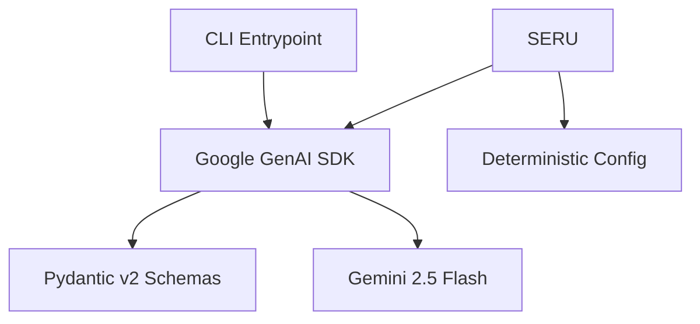

# Google Skills Boost - Generative IE, Ptython & SDK Oficial

Projeto demonstrativo e determinístico desenvolvido para comprovar domínio técnico do curso **Introduction to Generative AI** do Google Skills Boost.

## Arquitetura do Projeto



## Estrutura de Branches
- `feat/init-scaffolding-docs`: Infraestrutura, padrões de teste e ambiente.
- `feat/core-gemini-client`: Integração com o SDK oficial `google-genai` e configurações determinísticas.
- `feat/structured-outputs`: Structured Outputs com Pydantic v2 (auditoria e extração sem alucinação).
- `feat/responsible-ai-safety`: Safety settings, tratamento de recusas e exceções.
- `feat/e2e-pipeline-cli`: Entrypoint CLI e suíte completa de testes.

## Ambiente de Desenvolvimento
1. Cria√ß√£odÅdo virtualenv:
   ```bash
   python3.11 -m venv .venv
   source .venv/bin/activate
   pip install -- upgrade pip
   pip install -r requirements-dev.txt
   ```
2. Execu√ß√£odÅdos testes: `pytest`
